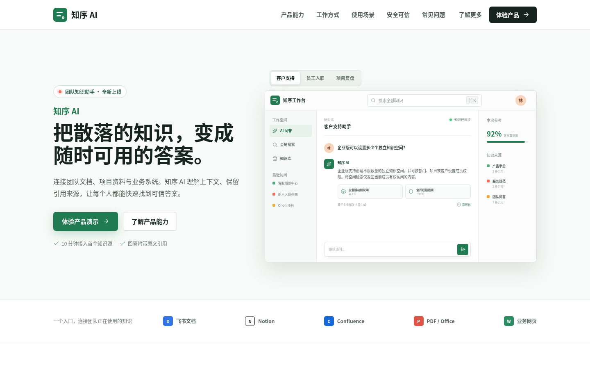
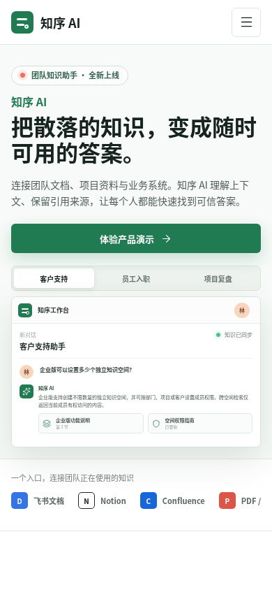

# 知序 AI · Baklib CMS 低代码主题与 AI 前端交互原型

面向团队知识管理与可信问答的 AI 产品官网。这是一个 **Baklib CMS 低代码主题作品**，同时包含一套完整的 **AI 知识工作台前端交互原型**。

> **在线体验**：https://site-djgggrkj.trial.baklib.site/

> **重要边界**：AI 工作台是前端交互原型，**没有接入真实大模型、后端服务、数据库、账号系统或 API 调用**。知识同步、置信度、权限继承等均为此作品的产品概念与演示数据，仓库中不含任何 API Key。

## 这是什么

- 基于 Baklib `WWW` 模板，使用 Liquid、Tailwind CSS v4、Alpine.js、Turbo、Stimulus 与 Lucide 重构的产品官网主题。
- 完整展示「Baklib 后台可编辑内容 + 前端高完成度交互」的低代码开发能力。
- 已部署为可在线访问的 Baklib 站点，后台内容与代码仓库双向可维护。

## 在线体验

- 线上站点：https://site-djgggrkj.trial.baklib.site/
- 源代码：https://github.com/zohan20050521-sudo/zhixu-ai-baklib

## 页面截图

| 桌面端（1440×900） | 手机端（390×844，取自线上站点） |
| --- | --- |
|  |  |

## 已实现内容

- 品牌首屏 + 可切换的 AI 知识工作台演示（三种场景、模拟问答与引用展示）
- 六项产品能力、三步接入流程、三类业务场景
- 权限与可信机制、FAQ、About、行动号召、页脚
- 桌面与移动端导航、场景切换、FAQ 互斥展开、锚点滚动与返回顶部

## Baklib 后台可编辑内容

- **站点设置**：品牌名、口号、导航菜单、了解更多/体验产品入口、公司介绍、版权与页脚菜单
- **首页字段**：首屏标签/标题/说明、按钮文字、核心能力区、四组 FAQ、底部 CTA
- **About 内容**：标题、说明与富文本正文（读取 Baklib 页面数据）
- **内容页面**：产品能力、使用场景、帮助中心、产品动态等栏目与文章

已验证真实流程：后台修改 FAQ 文案 → 保存发布 → 前台更新；GitHub 更新 → Baklib 组织模板 Pull → 应用自动更新。

## 源码中仍为硬编码的内容

- 六项能力卡片、三步工作流、三类使用场景、安全可信模块的文案
- 工作台三种演示场景与模拟答案（`src/javascripts/zhixu.js`）
- About 知识价值链的视觉标签与产品原则

以上属于视觉微文案，当前未纳入后台字段，后续可按需扩展。

## 技术栈与主要目录

Liquid · Tailwind CSS v4 · Alpine.js · Turbo · Stimulus · Lucide

```text
templates/index.mobile-app.liquid  首页入口与 Baklib Schema
snippets/zhixu/                    首页 Liquid 模块（首屏/FAQ/About 等）
src/stylesheets/zhixu/             首页各模块源样式
src/javascripts/zhixu.js           场景切换、FAQ 与滚动交互
seeds/                             站点设置与内容种子
scripts/build-preview.mjs          本地静态预览生成器
```

## 推荐演示路径（30–60 秒）

1. 打开线上站点，在首屏 AI 工作台切换三种演示场景，查看模拟问答与引用展示。
2. 下滑浏览六项能力、三步工作流与使用场景，体验 FAQ 互斥展开与移动端导航。
3. 打开 Baklib 后台（可选），展示 FAQ 文案可编辑并即时上线。

## 本地构建与预览

```bash
npm install
npm run build          # 构建 CSS 与 JS，输出到 assets/
npm run preview:build # 生成静态预览（不影响线上模板）
python3 -m http.server 4173
```

本地预览：http://127.0.0.1:4173/preview/

## Baklib 安装

1. 将本项目提交到可访问的 Git 仓库。
2. 在 Baklib「管理 → 组织模板 → Git 安装外部模板」填写仓库地址并安装。
3. 首页布局选择「知序 AI 产品首页」。
4. 在站点设置中确认品牌名、导航、页脚与行动按钮。

官方开发说明：https://dev.baklib.cn/guide/git

## 开发方式与 AI 协作边界

本作品的前端实现主要由 **AI 协作开发（Claude Code）** 完成：AI agent 依据任务卡实现代码、构建并提交，作者负责目标提出、约束设定、方案取舍、结果验收与 Baklib 平台流程。因此这是一份「AI 辅助完成的高完成度前端作品」，不能表述为作者独立手写全部前端代码。

作品中的 AI 相关描述均为产品概念与演示数据，没有真实的模型调用、账号系统或业务权限系统。若未来接入真实 AI，密钥必须保存在服务端或平台环境变量中，绝不进入浏览器 JavaScript、Git、日志或截图。
